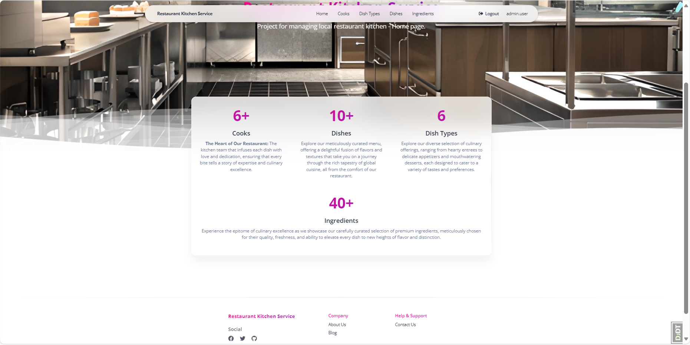

# Restaurant Kitchen Service

This is a Django project for a restaurant kitchen service. It allows users to manage things in kitchen like cooks, dishes, dish types and ingredients.


## Installation

Python3 must be already installed

1. Clone the repository:
```shell
git clone https://github.com/KolBohdan/restaurant-kitchen-service.git
```
2. Create a virtual environment and activate it:
```shell
python -m venv venv
venv\Scripts\activate (on Windows)
source venv/bin/activate (on macOS)
```
3. Install the project dependencies:
```shell
pip install -r requirements.txt
```
4. Create a database and migrate the models:
```shell
python manage.py migrate
```
5. Start the server:
```shell
python manage.py runserver
```
Use the following command to load prepared data from fixture:
```shell
python manage.py loaddata restaurant_kitchen_service_db_data.json
```
After loading data from fixture you can use following superuser (or create another one by yourself):

Login:```admin.user```

Password:```1qazcde3```

## Description

This project is a kitchen management system that helps cooks communicate and collaborate better.
It allows cooks to create new dishes dish types and ingredients, and specify who is responsible for cooking each dish.
The system also allows cooks to register new cooks.

This can help to improve communication and efficiency in the kitchen,
leading to better food and a more pleasant work environment for everyone.

## Features

* **Kitchen Management:** Create, update or delete your dishes, dish types and ingredients for them.
* **Search Functionality:** Quickly find cooks and dishes you want.
* **User-Friendly Interface:** Intuitive navigation.
* **User authentication and authorization:** The Restaurant Kitchen Service provides a robust user authentication and authorization system. This system allows restaurants to control who has access to different parts of the system and what actions they can perform.

## Home Page

